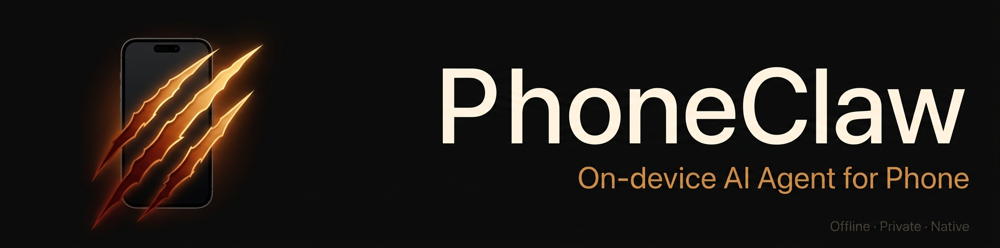

<div align="center">



本地运行的私人 iPhone AI Agent，不联网，不上传，完全离线。


[English](README_EN.md) · [报告问题](https://github.com/kellyvv/phoneclaw/issues) · [功能建议](https://github.com/kellyvv/phoneclaw/issues)

</div>

<div align="center">

[核心能力](#核心能力) · [内置 Skill](#内置-skill-示例) · [快速开始](#快速开始) · [自定义 Skill](#自定义-skill) · [常见问题](#常见问题) · [后续计划](#后续计划)

</div>

PhoneClaw 是一个运行在 iPhone 上的本地 AI Agent。它使用 Gemma 4 在设备端完成推理，不依赖云端，不上传聊天内容。


## 核心能力

**图片理解（多模态）**：拍照或从相册选图后直接提问，识别内容、解读图表、描述场景。模型在设备端完成推理，照片不会离开手机。

**基于文件的 Skill 系统**：每项能力对应一个 Markdown 文件（SKILL.md），新增或修改能力不需要重新编译 App。Skill 描述语言无关，任何人都可以直接编写和分发。

**完全离线与隐私保障**：所有推理都在手机端完成，默认不建立任何网络连接。聊天内容、图片、个人数据均不上传，不经过任何第三方服务器。

**灵活的模型管理**：支持 Gemma 4 E2B 和 E4B 两个规格，可在手机端直接下载，也可以在构建时打包进 App。内置模型切换、System Prompt 编辑，针对 iPhone 内存限制做了缓存清理和历史裁剪。

## 内置 Skill 示例

**日历**：用自然语言创建日历事件，支持指定标题、时间、地点。

> "明天下午两点，在高科技园区约了个会，帮我加到日历"

**提醒事项**：创建定时提醒，准时弹出系统通知，不会遗漏。

> "提醒我今晚八点发给老板那份文件"

**通讯录**：保存或更新联系人，支持姓名、手机号、公司、邮箱、备注，按手机号自动去重。

> "帮我存一下王总的电话 13812345678，字节跳动的"

**剪贴板**：读写系统剪贴板，可作为多步任务的数据中转。

> "把刚才那段文字复制到剪贴板"

**设备信息**：查询设备名称、系统版本、可用内存、处理器数量等。

> "这台手机的设备信息是什么"

**文本处理**：哈希计算、文本翻转等基础文本工具。

> "帮我算一下这段文字的 MD5"


## 快速开始

环境要求：macOS + Xcode 16，iOS 17+，CocoaPods，真机 + Apple ID

| 模型 | 适用场景 |
|------|---------|
| Gemma 4 E2B | 更稳，适合默认分发，A16 及以上 |
| Gemma 4 E4B | 效果更强，建议 iPhone 15 Pro 及以上 |

### 1. 克隆项目

```bash
git clone https://github.com/kellyvv/phoneclaw.git
cd phoneclaw
```

### 2. 安装依赖

```bash
pod install
```

### 3. 选择模型安装方式

**方案 A（推荐）— 空壳安装，手机端下载**

直接用 Xcode 把 App 安装到手机，打开后进入「模型设置」，在手机上直接下载 E2B 或 E4B。默认工程不会把 `Models/` 里的文件打入包，安装包更小，安装更快。

**方案 B — 打包 E2B 进 App**

1. 先在电脑下载模型到 `Models/gemma-4-e2b-it-4bit`（推荐用 Hugging Face CLI）：

```bash
brew install hf
mkdir -p ./Models/gemma-4-e2b-it-4bit
hf download mlx-community/gemma-4-e2b-it-4bit --local-dir ./Models/gemma-4-e2b-it-4bit
```

2. 在 Xcode `Build Phases > Copy Bundle Resources` 里手动把模型目录加进去
3. 修改 `LLM/MLXLocalLLMService.swift` 里的 `availableModels`，只保留要分发的模型

> E2B 约 3.58 GB，E4B 约 5.22 GB。`Models/` 已在 `.gitignore` 中忽略，不会提交到仓库。

**方案 C — 同时打包 E2B + E4B**

同上，两个模型目录都下载，并把两个 folder reference 都加回 `Copy Bundle Resources`。

### 4. 打开工程

```bash
open PhoneClaw.xcworkspace
```

> 请始终打开 `.xcworkspace`，不要打开 `.xcodeproj`

### 5. 配置签名并运行

1. 选择 PhoneClaw target → Signing & Capabilities
2. 选择 Team，把 Bundle Identifier 改成你自己的唯一值
3. 连接 iPhone，按 ⌘R

> 首次安装后如系统提示信任证书：设置 → 通用 → VPN 与设备管理 → 信任

### 6. 首次使用

- 右上角拼图：Skill 管理
- 右上角滑杆：模型设置 / 系统提示词 / 权限
- 空壳安装时，先在模型设置页下载模型，再开启权限，然后试试：

```
这台手机的设备信息是什么
提醒我今晚八点发文件
帮我存一下王总的电话 13812345678
```

## 自定义 Skill

新增一个 Skill 的最小成本方式，是在应用目录里增加一个 `SKILL.md`：

```
Application Support/PhoneClaw/skills/<skill-id>/SKILL.md
```

```yaml
---
name: MySkill
name-zh: 我的能力
description: 这个 Skill 的作用
version: "1.0.0"
icon: star
disabled: false

triggers:
  - 关键词1

allowed-tools:
  - my-tool-name

examples:
  - query: "用户会怎么说"
    scenario: "什么场景会触发"
---

# Skill 指令

告诉模型何时调用工具、如何组织参数、何时直接回答。
```

如果这个 Skill 需要真正调用系统能力，再去 `Skills/ToolRegistry.swift` 注册对应工具。


## 常见问题

为什么安装后看不到权限弹窗？
通常是因为对应 Skill 还没有真正执行到系统 API。如果之前已经拒绝过一次，iOS 也不会反复弹框，需要到系统设置里手动开启。

为什么切模型后加载失败？
先确认：模型目录名和代码里的 `availableModels` 一致；如果你走的是空壳安装，模型已经在手机端下载完成；如果你走的是内置分发，该模型确实被打进了 App 包；设备内存足够。

为什么提醒事项创建失败？
最新代码会先尝试复用现有提醒列表；如果系统里没有可写列表，会再尝试自动创建一个 PhoneClaw 提醒列表。如果这一步仍失败，通常是系统提醒源本身不可写。

## 后续计划

PhoneClaw 接下来的方向，不只是"多加几个工具"，而是把它逐步做成一个真正可用的本地 iPhone Agent。

### 1. 扩展更多 iOS 原生 API

- 文件与目录操作
- 照片读取、整理、描述、检索
- 备忘录 / Notes
- 本地通知
- 地图 / 位置相关能力
- Safari / URL 打开与上下文传递
- 更多通讯录、日历、提醒事项的读写能力

### 2. 扩展更多 Skill

后续会继续把能力拆成更清晰的 Skill，而不是把所有逻辑都堆在一个大 Prompt 里。适合继续追加的方向：

- 文件管理
- 照片理解与整理
- 日程规划
- 个人信息管理
- 本地知识库检索
- 语音输入 / 语音播报

### 3. 串联更多本地模型

除了主聊天模型之外，后续适合接入的本地模型：

- OCR 模型
- 语音识别模型
- 语音合成模型
- Embedding / Reranker 模型
- 更小的工具参数提取模型
- 更强的规划模型或多模型协作链路

这会让 PhoneClaw 从"一个大模型做所有事"，逐渐演进成"多个本地模型协同工作"的架构。

### 4. 跨 App 自动化

PhoneClaw 不会假设自己能像桌面系统那样任意操控所有 App，而是优先走 iOS 真正允许的能力：

- App Intents / Shortcuts
- URL Scheme / Deep Link
- Share Sheet / 分享扩展
- 剪贴板中转
- 系统通知与唤起

更现实的目标是：在 App 之间传递内容、拉起指定 App 到指定页面、把多步操作压缩成一条自然语言命令。

### 5. 外部硬件与视觉扩展

探索把外部视频输入、屏幕画面理解和本地模型串起来，让 PhoneClaw 不只是"在手机里回答问题"，而是逐步具备更强的现实世界感知与调度能力。

### 优先建议

如果按"最容易尽快做出体验差异"的顺序：

1. 文件 / 照片 / 备忘录 三类高频 API
2. Shortcuts / App Intents 集成
3. OCR + 语音识别
4. 本地知识库检索
5. 更细的自动化 Skill 编排


## 参考链接

- [Hugging Face CLI 文档](https://huggingface.co/docs/huggingface_hub/guides/cli)
- [Hugging Face 下载文档](https://huggingface.co/docs/huggingface_hub/en/guides/download)
- [Gemma 4 E2B MLX 模型](https://huggingface.co/mlx-community/gemma-4-e2b-it-4bit)
- [Gemma 4 E4B MLX 模型](https://huggingface.co/mlx-community/gemma-4-e4b-it-4bit)

## License

MIT
